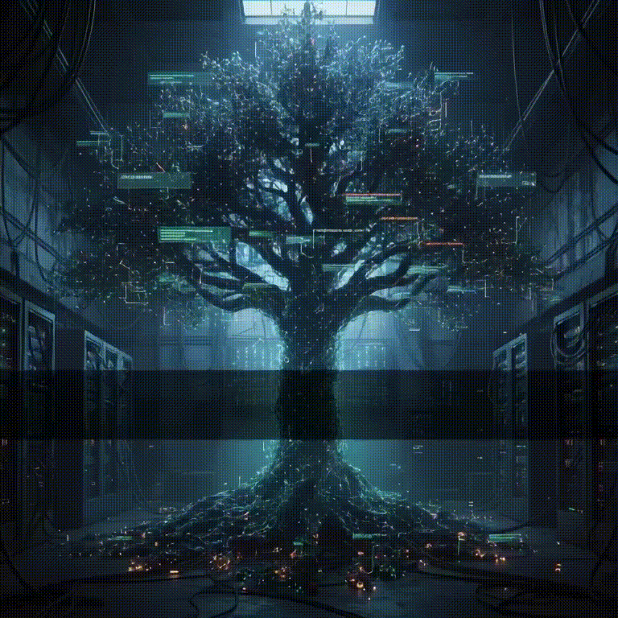

# Mi Blog

Este es mi blog personal donde escribo sobre tecnología, sistemas operativos y otros temas que me interesan.

## Sobre el blog

En este espacio, exploro y comparto conocimientos sobre una variedad de temas técnicos, con un enfoque principal en:

- **Sistemas Operativos:** Profundizo en configuraciones y experiencias con NixOS, OpenBSD y Arch Linux.
- **Gestores de Ventanas (Tiling WM):** Comparto mis configuraciones y flujos de trabajo con `cwm`, `bspwm` y `dwm`.
- **Seguridad y Privacidad:** Escribo sobre herramientas como `doas`, adblocking y la configuración de servicios como Unbound.
- **Redes Descentralizadas:** Exploro tecnologías emergentes como Yggdrasil.

## Tecnología Utilizada

Este blog está construido de forma sencilla utilizando:

- **Motor:** Deno con TypeScript (TSX)
- **Entorno de Desarrollo:** NixOS Flakes para una gestión de dependencias declarativa y reproducible.
- **Script de Publicación:** Un script en Python para automatizar tareas.

