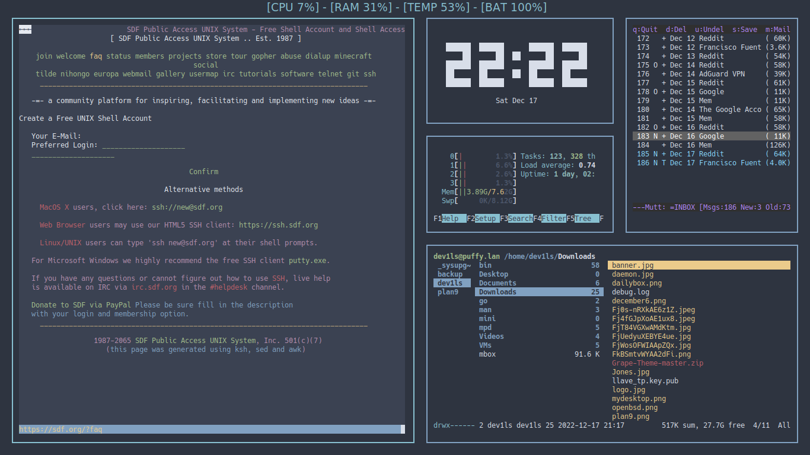

Es el escritorio y manejador de ventanas que utilizo actualmente. Estuve usando BSPWM y Xmonad pero soy amante de lo que consume poco recursos y en ese sentido todo lo "suckless" tiene ese objetivo.

dwm soporta múltiples espacios de trabajo y, a diferencia de ratpoison, permite mover y redimensionar las ventanas con el ratón. Del mismo círculo de desarrolladores (suckless), tenemos otro interesante programa, dmenu, que se integra perfectamente con dwm. dmenu es una utilidad-menú que se caracteriza por poder ser usado únicamente con el teclado. Permite al usuario buscar entre los programas instalados e iniciarlos.

[DWM - SuckLess Home Page ](https://suckless.org)


Aqui te dejo una de las formas mas sencillas de como instalar dwm en arch.. aqui te dejo el repositorio..

### Distrotube DWM

NOTA: Facil y muy bueno si es tu primer Window Manager.

[Distrotube GitLab](https://gitlab.com/dwt1/dwm-distrotube)

puedes bajar el repositorio y entrar en la carpeta  PKGBUILD from this reposity correr el comando:


```
makepkg -cf
```

Esto va generar un  .pkg.tar.zst ( ejemplo: dwm-distrotube-git-6.2-1-x86_64.pkg.tar.zst).  luego corre:

```
sudo pacman -U *.pkg.tar.zst
````

### Luke's DWM

NOTA:Uno de los mejores dots de DWM para compilar:

[Luke's build of dwm](https://github.com/LukeSmithxyz/dwm)

```bash
git clone https://github.com/LukeSmithxyz/dwm.git
cd dwm
sudo make install
```
